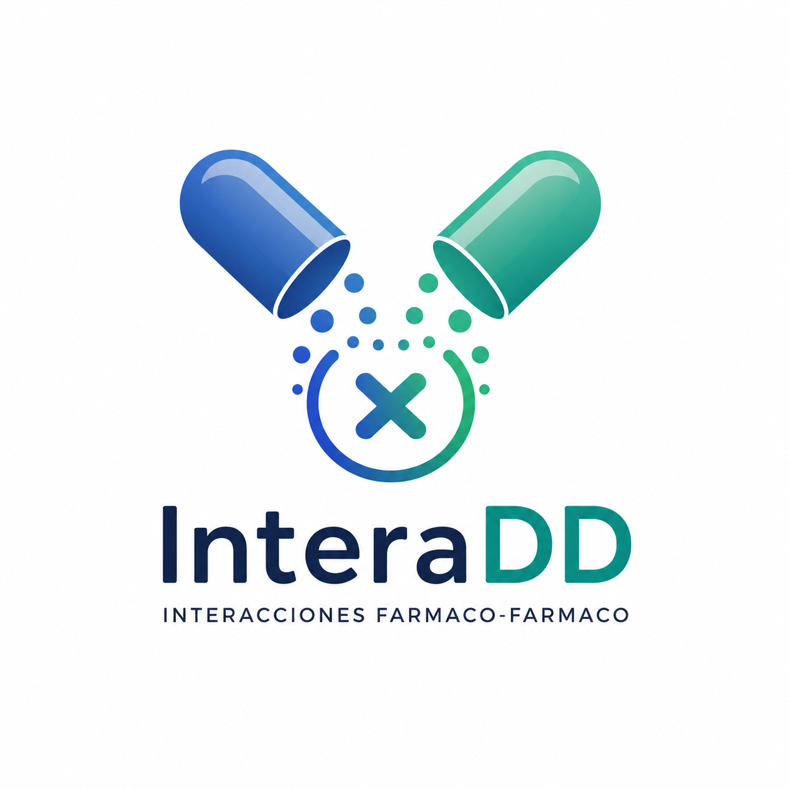

# InteraDD

<p align="center">
  
</p>

<p align="center">
  <b>Herramienta web para la detección e interpretación de interacciones farmacológicas basadas en el sistema enzimático CYP450.</b>
</p>

---

## Descripción

**InteraDD** es una herramienta web desarrollada como Trabajo Fin de Grado en Ingeniería de la Salud de la Universidad de Burgos.

La aplicación permite detectar e interpretar **interacciones farmacológicas (Drug-Drug Interactions, DDI)** mediante el análisis de las enzimas del sistema **Citocromo P450 (CYP450)** implicadas en el metabolismo de los principios activos.

A diferencia de muchos comprobadores de interacciones, InteraDD no solo identifica el nivel de riesgo y explica el mecanismo farmacológico responsable, sino que también muestra los efectos adversos asociados y propone alternativas terapéuticas compatibles cuando existen.

La información utilizada procede de las bases de datos **DrugBank**, **CIMA (AEMPS)** y **SIDER**, integradas mediante un proceso previo de extracción, limpieza y normalización de datos.

---

## Características principales

- Detección de posibles interacciones entre dos principios activos.
- Clasificación del nivel de riesgo (Bajo, Medio o Alto).
    - 🟢 Low
    - 🟡 Medium
    - 🔴 High
- Identificación de las enzimas CYP450 implicadas y del papel de cada principio activo (sustrato, inhibidor o inductor).
- Explicación del mecanismo farmacocinético responsable de la interacción.
- Visualización gráfica de los efectos adversos asociados.
- Propuesta de alternativas terapéuticas consideradas seguras para la aplicación basada en la clasificación ATC.
- Interfaz web interactiva desarrollada con Dash.

---

## Tecnologías utilizadas

- Python 3.11
- Dash
- Dash Bootstrap Components
- Plotly
- Pandas

---

## Bases de datos utilizadas

La herramienta integra información procedente de tres fuentes biomédicas de referencia:
- **DrugBank** Principios activos, enzimas CYP450, acciones farmacológicas y códigos ATC. 
- **CIMA (AEMPS)** Fichas técnicas oficiales para la identificación de las principales vías metabólicas. 
- **SIDER** Efectos adversos asociados a los medicamentos. 

Antes de ejecutar la aplicación, toda esta información pasa por un proceso de extracción, limpieza, integración y normalización que genera los conjuntos de datos optimizados utilizados por la aplicación.

---

## Estructura del GitHub

```text
TFG/
│
├── app.py                      # Aplicación principal
├── textos.py                   # Funciones utilizadas en la aplicación
├── DDI_sea.csv                 # Base de datos farmacológica integrada
├── efectos_adversos.csv        # Base de datos de efectos adversos
├── requirements.txt            # Dependencias 
├── README.md                   # Información básica de uso del proyecto
├── .gitignore
│
├── assets/                     # Carpeta con el logo de la aplicación
│   └── logo.png
│
├── Notebooks ejecucion BBDD/   # Scripts de extracción, limpieza y transformación.
│   ├── Ejecucion_BBDD.ipynb     
│   ├── Funciones_BBDD.py       
│   └── Union csvs.ipynb
│
└── memoria y anexos/           # Contiene la memoria y anexos creados
    ├── memoria.pdf
    └── anexos.pdf
```

---

## Funcionamiento

El funcionamiento general de la herramienta es el siguiente:

1. El usuario selecciona dos principios activos.
2. Se consultan los datos farmacológicos integrados.
3. Se identifican las enzimas CYP450 implicadas en el metabolismo de ambos fármacos.
4. Se calcula el nivel de riesgo de interacción.
5. Se explica el mecanismo farmacológico responsable.
6. Se muestran los efectos adversos asociados.
7. Se proponen alternativas terapéuticas compatibles cuando estas se encuentran disponibles.

---

## Instalación

1. Clonar el repositorio

```bash
git clone https://github.com/CarmenRu/TFG.git

cd TFG
```

2. Crear un entorno virtual (recomendado mediante Conda)
```bash
conda create -n interadd python=3.11
conda activate interadd
```

3. Instalar las dependencias

```bash
pip install -r requirements.txt
```

4. Ejecutar la aplicación

```bash
python app.py
```

La aplicación estará disponible en la dirección que se muestra en la terminal, normalmente será:

```
http://127.0.0.1:8050/
```

También se dispone de una plataforma con la aplicación ya renderizada, con lo que no sería necesaria la instalación localmente. Se encuentra en la siguiente dirección:
```
https://tfg-7z0a.onrender.com/
```

---

## Generación de la base de datos

Además de la aplicación, el repositorio incluye el código utilizado para construir la base de datos farmacológica empleada por InteraDD.

La carpeta **Notebooks ejecucion BBDD/** contiene:

- **Ejecucion_BBDD.ipynb** Ejecuta el proceso completo de extracción y procesamiento de las bases de datos originales incluyendo la metodología que se llevó a cabo manualmente con el apoyo de IAs generativas. 
- **Funciones_BBDD.py**  Implementa las funciones encargadas de procesar la información procedente de DrugBank, CIMA y SIDER. 
- **Union csvs.ipynb**  Une y depura los distintos conjuntos de datos para generar los archivos CSV finales utilizados por la aplicación. 

Estos archivos únicamente son necesarios para regenerar la base de datos. Para ejecutar la aplicación basta con disponer de los archivos `DDI_sea.csv` y `efectos_adversos.csv`.

---

## Archivos principales

- **app.py** Aplicación principal desarrollada con Dash.
- **textos.py** Funciones que constituyen el algoritmo encargado del análisis farmacológico y de la generación de explicaciones. 
- **DDI_sea.csv** Base de datos farmacológica integrada. 
- **efectos_adversos.csv** Base de datos de efectos adversos. 
- **requirements.txt** Dependencias necesarias para ejecutar el proyecto. 

---

## Limitaciones

Este proyecto constituye una **prueba de concepto** y presenta algunas limitaciones:

- Solo analiza interacciones farmacocinéticas mediadas por enzimas CYP450.
- La calidad de los resultados depende de la información disponible en las bases de datos utilizadas.
- Las alternativas terapéuticas se proponen a partir de la clasificación ATC y del algoritmo desarrollado.
- La herramienta no sustituye el criterio de un profesional sanitario y no debe emplearse como sistema de apoyo a la decisión clínica.

---

## Líneas futuras

Entre las posibles mejoras del proyecto se encuentran:

- Incorporación de nuevas bases de datos farmacológicas.
- Inclusión de interacciones farmacodinámicas.
- Integración de información farmacogenética.
- Mejora del algoritmo de recomendación de alternativas.
- Automatización del proceso de actualización de la base de datos.
- Validación clínica con profesionales sanitarios.

---

## Documentación

La memoria completa del Trabajo Fin de Grado y los anexos técnicos pueden consultarse en la carpeta:

```
memoria y anexos/
```

---

## Autora

**Carmen Ruiz Alonso**

Grado en Ingeniería de la Salud

Universidad de Burgos

Curso académico **2025-2026**

---

## Aviso

Este software ha sido desarrollado con fines académicos.

La información proporcionada por la aplicación no debe utilizarse como sustituto del criterio clínico ni de la consulta a fuentes oficiales para la toma de decisiones sanitarias. Dado que se trata de una prueba incial de concepto y muestra limitaciones.